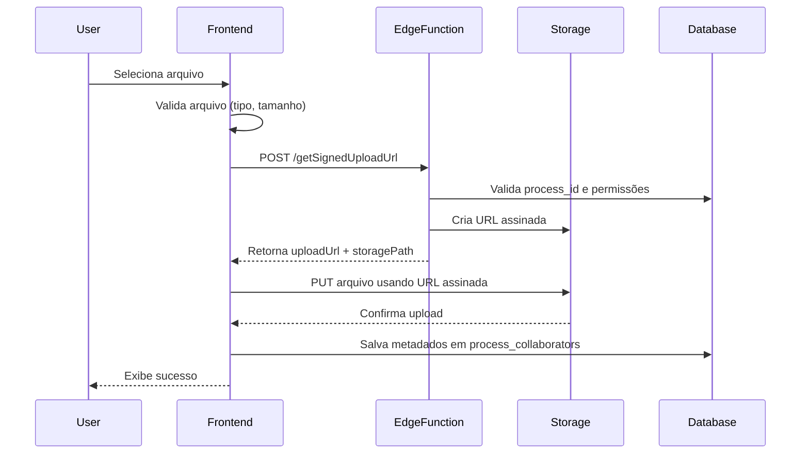

# Teste de Upload de Procuração

## Pré-requisitos

1. Supabase configurado e funcionando
2. Bucket 'docs' criado com as políticas RLS
3. Edge Function `getSignedUploadUrl` deployada
4. Usuário autenticado no sistema

## Passo a Passo para Testar

### 1. Fazer Login no Sistema

1. Acesse a aplicação
2. Faça login com suas credenciais
3. Crie ou acesse um processo existente

### 2. Adicionar Colaborador

1. Na tela de detalhes do processo, vá para a aba "Colaboração"
2. Clique em "Convidar" colaborador
3. Adicione o email do colaborador
4. Escolha o nível de permissão
5. Envie o convite

### 3. Fazer Upload da Procuração

1. Na lista de colaboradores, clique em "Adicionar Procuração"
2. Clique em "Selecionar Arquivo"
3. Escolha um arquivo PDF, imagem ou documento Word
4. Clique em "Fazer Upload"
5. Aguarde a barra de progresso chegar a 100%
6. Veja a mensagem de sucesso

### 4. Verificar Upload

Você verá:
- Nome do arquivo
- Tamanho do arquivo
- Data de upload
- Botões para download e exclusão

### 5. Download do Arquivo

1. Clique no botão de download (ícone de seta para baixo)
2. O arquivo abrirá em uma nova aba
3. Verifique se é o arquivo correto

### 6. Excluir Arquivo (Opcional)

1. Clique no botão de exclusão (ícone de lixeira)
2. Confirme a exclusão
3. O campo de upload ficará disponível novamente

## Fluxo Técnico



## Validações Implementadas

### Frontend
- Tipo de arquivo: PDF, JPG, PNG, DOC, DOCX
- Tamanho máximo: 50MB
- Arquivo selecionado antes de upload

### Edge Function
- Usuário autenticado
- Process_id válido
- Usuário é dono do processo
- Campos obrigatórios presentes

### Storage (RLS)
- Apenas dono do processo pode fazer upload
- Path no formato: `{process_id}/{timestamp}-{random}-{filename}`
- Bucket privado (não acessível publicamente)

## Tratamento de Erros

### Erro: "Arquivo muito grande"
**Causa**: Arquivo maior que 50MB
**Solução**: Comprimir o arquivo ou usar um menor

### Erro: "Tipo de arquivo não permitido"
**Causa**: Formato não suportado
**Solução**: Converter para PDF, JPG, PNG, DOC ou DOCX

### Erro: "You do not have permission"
**Causa**: Usuário não é dono do processo
**Solução**: Apenas o dono pode fazer upload

### Erro: "Failed to create signed upload URL"
**Causa**: Bucket não criado ou políticas incorretas
**Solução**: Executar migrations do banco

### Erro: "Upload failed"
**Causa**: Conexão ou problema no storage
**Solução**: Verificar conexão e tentar novamente

## Verificação Manual no Supabase

### 1. Verificar Storage
```sql
SELECT * FROM storage.objects WHERE bucket_id = 'docs';
```

### 2. Verificar Metadados
```sql
SELECT
  id,
  user_id,
  process_id,
  procuracao_file_id,
  procuracao_storage_path,
  procuracao_file_metadata
FROM process_collaborators
WHERE procuracao_file_id IS NOT NULL;
```

### 3. Verificar Logs da Edge Function
1. Acesse Supabase Dashboard
2. Vá em "Edge Functions"
3. Selecione "getSignedUploadUrl"
4. Veja os logs de execução

## Performance Esperada

- Validação de arquivo: < 100ms
- Geração de URL assinada: < 500ms
- Upload de arquivo (10MB): 2-5 segundos
- Salvamento de metadados: < 200ms

**Total para arquivo de 10MB**: 3-6 segundos

## Notas de Segurança

1. URLs assinadas expiram automaticamente
2. Apenas o dono do processo tem acesso
3. Arquivos são privados por padrão
4. Validação em múltiplas camadas:
   - Frontend (UX)
   - Edge Function (Lógica)
   - Storage RLS (Segurança)
   - Database RLS (Dados)

## Próximos Passos

Após testar com sucesso:
1. Implementar notificações de upload
2. Adicionar histórico de uploads
3. Implementar preview de documentos
4. Adicionar assinatura digital
5. Implementar versionamento de arquivos
